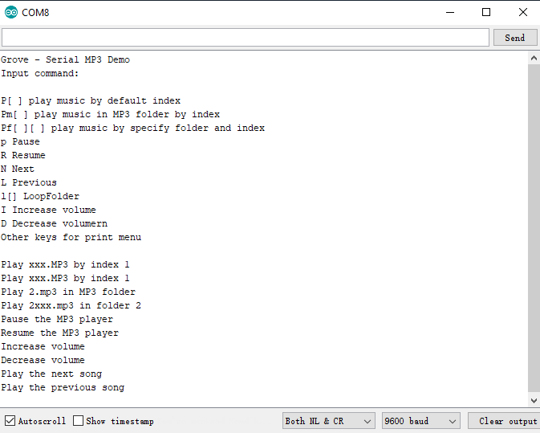
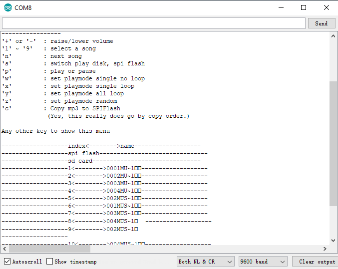

# Grove Serial MP3 Player

This library supports both KT403A and WT2003S. 

&emsp;&emsp;&emsp;&emsp;&emsp;&emsp;&emsp;&emsp;&emsp;&emsp;&emsp;&emsp;

[Grove - Serial Player KT403A](https://www.seeedstudio.com/Grove-MP3-v2.0-p-2597.html)

&emsp;&nbsp;&nbsp;&nbsp;&nbsp;&nbsp;&nbsp;&nbsp;&nbsp;&nbsp;&nbsp;&nbsp;&nbsp;&nbsp;&nbsp;&nbsp;&nbsp;&nbsp;&emsp;&emsp;&emsp;&emsp;&emsp;&emsp;&emsp;

Grove - Serial Player WT2003S

### connection of the hardware

 

Connect MP3 Player to the serial port of the board. In this example, we use software serial as the serial port (D2<RX>, D3<TX>); If you have other hardware Serial ports on you board, you can also connect to it.

------

### Software usage

- Install Seeed Grove Serial MP3 Player library  to Arduino.

- Start a project.

- Verify the MP3 audio chip what you use, then construct an object.

  - If you want to use the functionality Shared by both wt2003 and KT403A.

    ```
    #include "SeeedGroveMP3.h"
    #include "KT403A_Player.h"
    #include "WT2003S_Player.h"
    
    // if you user Software Serial
    #include <SoftwareSerial.h>
    SoftwareSerial SSerial(2, 3); // RX, TX
    #define COMSerial SSerial
    #define ShowSerial Serial 
    
    // uncomment the chip what you choose
    //MP3Player<WT2003S<SoftwareSerial>> Mp3Player;
    MP3Player<KT403A<SoftwareSerial>> Mp3Player;
    
    
    // if you user the Hardware Serial.
    // uncomment the chip what you choose
    //MP3Player<WT2003S<HardwareSerial>> Mp3Player;
    MP3Player<KT403A<HardwareSerial>> Mp3Player;
    ```

     Then initialize MP3player in the setup function.	

     ```
    Mp3Player.controller->init(COMSerial); //use Software Serial.
    Mp3Player.controller->init(Serial1);   //use Hardware Serial1.
     ```

  ​        Note: You need to use the controller of Mp3Player to perform the correct functions.

  - If you want to use more features on a specific chip, such as KT403A

    ```
    #include "KT403A_Player.h"
    #ifdef __AVR__
    #include <SoftwareSerial.h>
    SoftwareSerial SSerial(2, 3); // RX, TX
    #define COMSerial SSerial
    #define ShowSerial Serial 
    
    KT403A<SoftwareSerial> Mp3Player;
    #endif
    
    #ifdef ARDUINO_SAMD_VARIANT_COMPLIANCE
    #define COMSerial Serial1
    #define ShowSerial SerialUSB 
    
    KT403A<Uart> Mp3Player;
    #endif
    
    #ifdef ARDUINO_ARCH_STM32F4
    #define COMSerial Serial
    #define ShowSerial SerialUSB 
    
    KT403A<HardwareSerial> Mp3Player;
    #endif
    ```

    Then initialize MP3player in the setup function

    ```
    Mp3Player.init(COMSerial); //use Software Serial.
    Mp3Player.init(Serial1);   //use Hardware Serial1.
    ```

    Note: You dont't need to use the controller of Mp3Player to perform the correct functions.

------


### Introduction of the API


#### KT403A

- No specified folder name or music file name, you can store MP3 files any where in microSD card.

  ```
   playSongIndex(index);
  ```

- Play music by specified folder and file index.

  ```
   playSongSpecify(folder, index);
  ```

  Folder and files' names rules:

  01/001***.mp3

  01/002***.mp3

  01/999***.mp3

  03/001***.mp3

  04/002***.mp3

- play music in MP3 folder.

  ```
   playSongMP3(index);
  ```

  Names rules:

  MP3/0001.mp3

  MP3/0002.mp3

  MP3/0003.mp3

  MP3/0004.mp3




For more information please visit [wiki](http://wiki.seeedstudio.com/Grove-MP3_v2.0/).  

------


#### WT2003S

- Play music in SD root.

  ```
  playSDRootSong(index);
  ```

-  Specify the directory and music index to play in SD Card.

  ```
  playSDDirectorySong(dir, index) 
  ```

  playSDDirectorySong("MP3", 1);  mean that play the song 1 in the folder "MP3

- Specify the music name to play in SD Card root.

  ```
  playSDSong(fileName)
  ```

  playSDDirectorySong("hello.mp3"); mean that play the song "hello.mp3" in the SD root.



----

This demo is licensed under [The MIT License](http://opensource.org/licenses/mit-license.php). Check License.txt for more information.<br>

Contributing to this software is warmly welcomed. You can do this basically by<br>
[forking](https://help.github.com/articles/fork-a-repo), committing modifications and then [pulling requests](https://help.github.com/articles/using-pull-requests) (follow the links above<br>
for operating guide). Adding change log and your contact into file header is encouraged.<br>
Thanks for your contribution.

Seeed Studio is an open hardware facilitation company based in Shenzhen, China. <br>
Benefiting from local manufacture power and convenient global logistic system, <br>
we integrate resources to serve new era of innovation. Seeed also works with <br>
global distributors and partners to push open hardware movement.<br>

[](https://github.com/igrigorik/ga-beacon)